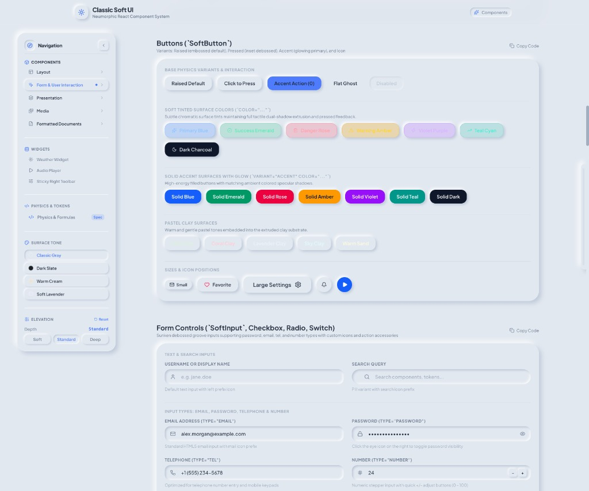
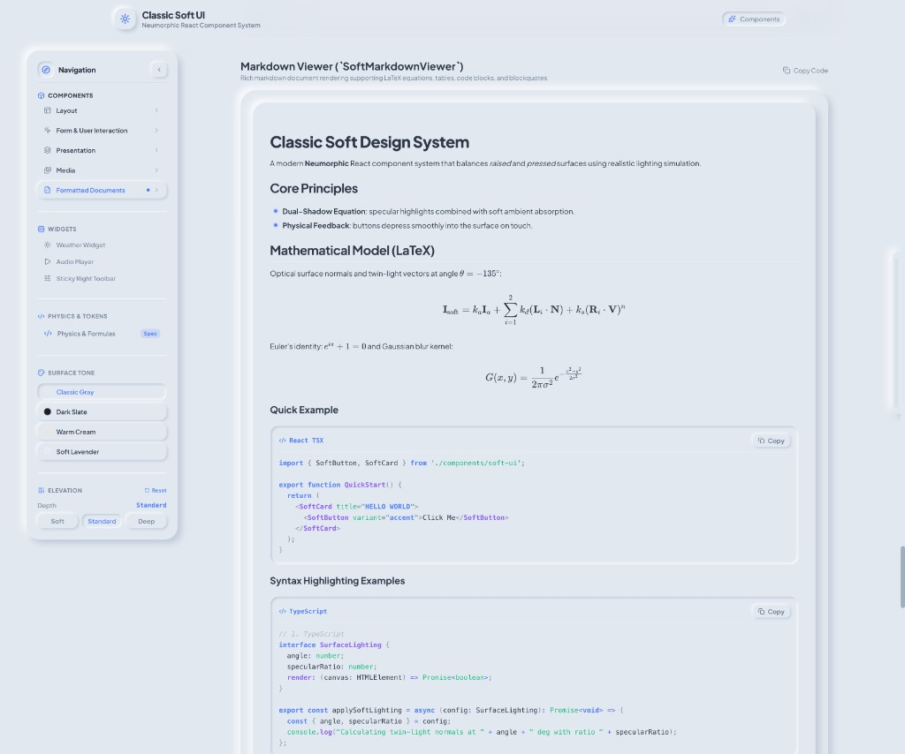
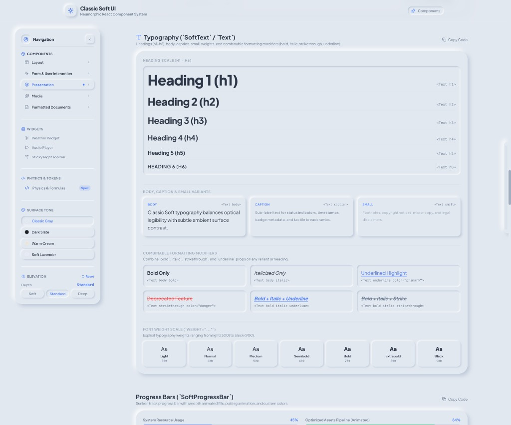

# Soft Glass UI

A modern, tactile **Neumorphic & Soft Glass React component system** engineered with realistic lighting physics, dual-shadow absorption equations, and fluid multi-tone theme support.

Built with **React 19**, **TypeScript**, **Tailwind CSS v4**, and **Vite**.



---

## ✨ Features

- 🌟 **Physically-Modeled Shadows**: Specular highlights combined with ambient absorption vectors calculated from a top-left light source ($\theta = -135^\circ$).
- 🎛️ **Tactile Feedback**: Smooth, realistic transitions between elevated surfaces (`raised`) and debossed wells (`pressed`).
- 🎨 **Multi-Tone Themes**:
  - **Classic Soft** (Clean Slate Gray)
  - **Dark Slate** (High-contrast deep neumorphism)
  - **Warm Sand** (Cozy organic paper tone)
  - **Lavender Dusk** (Vibrant playful purple tone)
- 📐 **25+ Production-Ready Components**: Complete component suite covering layouts, form controls, rich media viewers, and interactive widgets.
- 🧮 **Rich Markdown & LaTeX**: Built-in `SoftMarkdownViewer` with KaTeX equation rendering, Prism syntax highlighting, and responsive table support.
- ⚡ **Modern Stack**: Powered by React 19, Tailwind CSS v4, Vite 8, and Oxlint for sub-millisecond linting and high-performance builds.

---

## 📸 Visual Showcase

### 1. Tactile Buttons & Sunken Form Controls

Embossed primary buttons, soft chromatic surface tints, solid glowing accents, pastel clay surfaces, sunken debossed search & text inputs, password visibility toggles, and numeric steppers.


### 2. Markdown Viewer with LaTeX Equations & Code Highlighting

Integrated `SoftMarkdownViewer` rendering mathematical models with KaTeX, CommonMark formatting, responsive tables, and PrismJS syntax-highlighted code blocks with one-click copy.



### 3. Typography Scale & Progress Bars

Heading hierarchy (h1–h6), body, caption, and small typography variants, combinable formatting modifiers (bold, italic, strikethrough, underline highlights), 9-step font weight scale, and sunken debossed animated progress bars.



---

## 📦 Component Suite

| Category               | Components                                                                                                                                                                                                |
| ---------------------- | --------------------------------------------------------------------------------------------------------------------------------------------------------------------------------------------------------- |
| **Surfaces & Layout**  | `SoftCard`, `SoftLayout`, `SoftSidebar`, `SoftStickyToolbar`, `SoftDivider`                                                                                                                               |
| **Actions & Controls** | `SoftButton`, `SoftSwitch`, `SoftSlider`, `SoftSelectionControls` (Checkbox, Radio, Segmented), `SoftTabs`, `SoftPopupMenu`                                                                               |
| **Data Entry**         | `SoftInput`, `SoftDateTimePicker`                                                                                                                                                                         |
| **Feedback & Dialogs** | `SoftDialog`, `SoftToast` (with `useToast`), `SoftProgressBar`                                                                                                                                            |
| **Media & Display**    | `SoftMarkdownViewer`, `SoftPDFViewer`, `SoftAudioPlayer`, `SoftVideoPlayer`, `SoftImageGallery`, `SoftImage`, `SoftAvatar`, `SoftIconBox`, `SoftChip`, `SoftBreadcrumbs`, `SoftWeatherWidget`, `SoftText` |

---

## 🚀 Getting Started

### Prerequisites

- Node.js 18+ (Node.js 20+ recommended)
- npm, pnpm, or yarn

### Installation

```bash
# Clone the repository
git clone git@github.com:tyuan73/soft-glass-ui.git
cd soft-glass-ui

# Install dependencies
npm install
```

### Development Server

Start the interactive component catalog and widget showcase:

```bash
npm run dev
```

Open [http://localhost:6500](http://localhost:6500) in your browser.

### Production Build

```bash
npm run build
```

The compiled output will be generated in `dist/`.

---

## 💡 Usage Examples

### 1. Basic Card & Button

```tsx
import React from 'react';
import { SoftCard, SoftButton } from './components/soft-ui';

export function ExampleCard() {
  return (
    <SoftCard elevation="md" rounded="2xl" className="p-6 max-w-sm">
      <h3 className="text-lg font-bold mb-2">Classic Soft Neumorphism</h3>
      <p className="text-sm text-[var(--soft-text-muted)] mb-4">
        Surfaces naturally emerge from the canvas with soft dual-shadows.
      </p>
      <div className="flex gap-3">
        <SoftButton variant="raised" elevation="sm">
          Cancel
        </SoftButton>
        <SoftButton variant="accent">Confirm</SoftButton>
      </div>
    </SoftCard>
  );
}
```

### 2. Form Controls & Sliders

```tsx
import React, { useState } from 'react';
import { SoftSwitch, SoftSlider, SoftInput } from './components/soft-ui';

export function SettingsControl() {
  const [enabled, setEnabled] = useState(true);
  const [intensity, setIntensity] = useState(75);
  const [label, setLabel] = useState('');

  return (
    <div className="space-y-4 max-w-md p-6">
      <SoftInput
        label="Surface Label"
        placeholder="e.g. Ambient Light"
        value={label}
        onChange={(e) => setLabel(e.target.value)}
      />

      <div className="flex items-center justify-between">
        <span className="text-sm font-medium">Enable Specular Highlights</span>
        <SoftSwitch checked={enabled} onChange={setEnabled} />
      </div>

      <div>
        <label className="text-sm font-medium">Absorption Intensity: {intensity}%</label>
        <SoftSlider min={0} max={100} value={intensity} onChange={setIntensity} />
      </div>
    </div>
  );
}
```

### 3. Markdown Document with LaTeX & Code Highlighting

```tsx
import React from 'react';
import { SoftMarkdownViewer } from './components/soft-ui';

const doc = `
# Mathematical Model

Surface lighting equation:

$$
\\mathbf{I}_{\\text{soft}} = k_a \\mathbf{I}_a + \\sum_{i=1}^2 k_d (\\mathbf{L}_i \\cdot \\mathbf{N}) + k_s (\\mathbf{R}_i \\cdot \\mathbf{V})^n
$$

\`\`\`typescript
export const applyLighting = (ambient: number, specular: number) => {
  return ambient + specular * 0.85;
};
\`\`\`
`;

export function DocumentViewer() {
  return <SoftMarkdownViewer content={doc} />;
}
```

---

## 🔬 Neumorphic Physics & Shadow System

Soft Glass UI computes elevations through balanced positive and negative box-shadow offsets aligned along a diagonal lighting vector ($\theta = -135^\circ$):

$$
\mathbf{I}_{\text{soft}} = k_a \mathbf{I}_a + \sum_{i=1}^2 k_d (\mathbf{L}_i \cdot \mathbf{N}) + k_s (\mathbf{R}_i \cdot \mathbf{V})^n
$$

### Shadow Elevation Classes

```css
/* Raised Surface (Extrudes outward) */
.soft-raised-xs {
  box-shadow:
    2px 2px 5px var(--shadow-dark),
    -2px -2px 5px var(--shadow-light);
}
.soft-raised-sm {
  box-shadow:
    4px 4px 8px var(--shadow-dark),
    -4px -4px 8px var(--shadow-light);
}
.soft-raised-md {
  box-shadow:
    7px 7px 14px var(--shadow-dark),
    -7px -7px 14px var(--shadow-light);
}
.soft-raised-lg {
  box-shadow:
    12px 12px 24px var(--shadow-dark),
    -12px -12px 24px var(--shadow-light);
}
.soft-raised-xl {
  box-shadow:
    18px 18px 36px var(--shadow-dark),
    -18px -18px 36px var(--shadow-light);
}

/* Pressed Surface (Depressed / Inset well) */
.soft-pressed-xs {
  box-shadow:
    inset 2px 2px 4px var(--shadow-inset-dark),
    inset -2px -2px 4px var(--shadow-inset-light);
}
.soft-pressed-sm {
  box-shadow:
    inset 3px 3px 6px var(--shadow-inset-dark),
    inset -3px -3px 6px var(--shadow-inset-light);
}
.soft-pressed-md {
  box-shadow:
    inset 5px 5px 10px var(--shadow-inset-dark),
    inset -5px -5px 10px var(--shadow-inset-light);
}
.soft-pressed-lg {
  box-shadow:
    inset 8px 8px 16px var(--shadow-inset-dark),
    inset -8px -8px 16px var(--shadow-inset-light);
}
```

### Switching Themes Dynamically

Set the `data-theme` attribute on the root or container element:

```html
<!-- Themes: default (light), dark, warm, lavender -->
<html data-theme="dark"></html>
```

---

## 🛠️ Project Scripts

| Command                | Description                                                      |
| ---------------------- | ---------------------------------------------------------------- |
| `npm run dev`          | Starts Vite local development server at `http://localhost:6500`  |
| `npm run build`        | Type-checks with `tsc -b` and builds production bundle with Vite |
| `npm run preview`      | Previews production build locally                                |
| `npm run lint`         | Runs fast Oxlint checks across all TypeScript and React files    |
| `npm run format`       | Formats all codebase files with Prettier                         |
| `npm run format:check` | Verifies formatting compliance with Prettier                     |

---

## 📁 Directory Structure

```
soft-glass-ui/
├── docs/
│   └── screenshots/        # Visual documentation showcases
├── public/                 # Static assets (favicons, SVG icons)
├── src/
│   ├── components/         # Component implementations
│   │   ├── soft-ui/        # Core Soft UI library components
│   │   └── LeftNavbar.tsx  # Interactive navigation drawer
│   ├── demo/               # Showcase catalog & interactive widgets
│   │   ├── ComponentCatalog.tsx
│   │   ├── ThemeCustomizer.tsx
│   │   └── WidgetsPage.tsx
│   ├── styles/             # Neumorphic tokens & syntax themes
│   │   ├── soft-tokens.css # Lighting variables, elevation shadows
│   │   └── prism-soft.css  # Soft UI code syntax theme & KaTeX styles
│   ├── utils/              # Utility helpers & class merger (cn)
│   ├── App.tsx             # Main showcase application shell
│   ├── index.css           # Tailwind v4 imports & base resets
│   └── main.tsx            # Application entrypoint
├── package.json
├── tsconfig.json
└── vite.config.ts
```

---

## 📄 License

MIT © [Yuan Tian](https://github.com/tyuan73)
